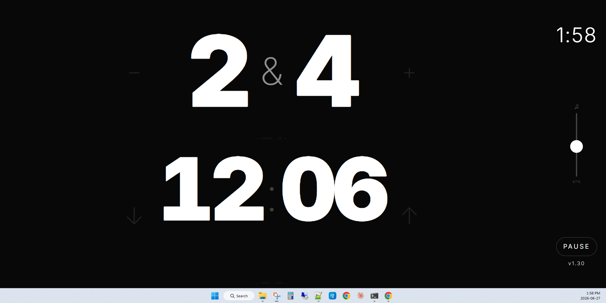

# Blinds UP! — Free Poker Blind Timer

A free, no-install poker blinds timer that runs in any browser. Works on phones, tablets, and laptops. No ads, no accounts, no app store.

**[▶ Launch the timer →](https://netwerxs.github.io/BlindsUP/)**



---

## Features

- **25 blind levels** — 1/2 through 25/50, automatically sequenced
- **Alarm** — 7-blast horn synthesized in-browser when blinds go up
- **Countdown ticks** — accelerating tick sounds for the last 12 seconds
- **Break screen** — level 5 pauses the countdown with a "Winding Down" screen; tap **Begin Freezeout** when ready
- **Adjustable timer** — add or subtract 30 seconds on the fly
- **Volume slider** — live preview; set device volume to max, then dial in with the slider
- **Wall clock** — always visible so you're not hunting for your phone
- **Touch and mouse** — swipe on phones/tablets; click ±zones on desktop
- **Full screen + landscape lock** — press F11 on desktop; install to home screen on mobile for true full screen and automatic landscape orientation
- **Works offline** — installable PWA with service worker
- **Zero dependencies** — one HTML file, no build step, no backend

## Install as an app (recommended for iPad)

Blinds UP works best when installed to your home screen. You get:

- **Landscape lock** — screen stays horizontal automatically
- **Full screen** — no browser chrome in the way
- **Works offline** — no Wi-Fi needed at the table

**iPad / iPhone — Safari:**

1. Open **[https://netwerxs.github.io/BlindsUP/](https://netwerxs.github.io/BlindsUP/)** in Safari
2. Tap the **Share** button (box with arrow pointing up) in the toolbar
3. Scroll down and tap **Add to Home Screen**
4. Tap **Add** in the top-right corner
5. Open the app from your home screen — it launches full screen in landscape

> Safari is required on iOS/iPadOS. Chrome and Firefox on iPhone/iPad do not support PWA installation.

**Android — Chrome:**

1. Open the site in Chrome
2. Tap the three-dot menu → **Add to Home screen**
3. Tap **Add**

**Windows / Mac — Chrome or Edge:**

Click the install icon (⊕) in the address bar, or go to the browser menu → **Install Blinds UP**.

---

## Blind Schedule

| Levels | Blinds | Duration |
|--------|--------|----------|
| 1–4 | 1/2 → 4/8 | 15 min each |
| 5 | 5/10 | Break (Winding Down — no countdown) |
| 6–25 | 6/12 → 25/50 | 10 min each (Freezeout) |

## Controls

| Action | Touch | Mouse / Keyboard |
|--------|-------|-----------------|
| Go up one blind level | Swipe right on blinds | Click right half of blinds |
| Go down one blind level | Swipe left on blinds | Click left half of blinds |
| Add 30 seconds | Swipe left on timer | Click right half of timer |
| Subtract 30 seconds | Swipe right on timer | Click left half of timer |
| Pause / Resume | Tap Pause | Click Pause |
| Full screen | Add to home screen | F11 |
| Return to menu | Hold Esc 3 seconds | Hold Esc 3 seconds |

## Running locally

No build step. Just open the file:

```
open index.html
```

Or serve it for PWA/service-worker support:

```
npx serve .
# or
python -m http.server
```

## How it works

Everything is in `index.html` — HTML, CSS, and vanilla JavaScript. No frameworks, no bundler, no server. Audio is synthesized with the Web Audio API. The timer uses wall-clock math (`Date.now()`) rather than accumulated intervals, so it stays accurate even when the tab is throttled.

## License

MIT
