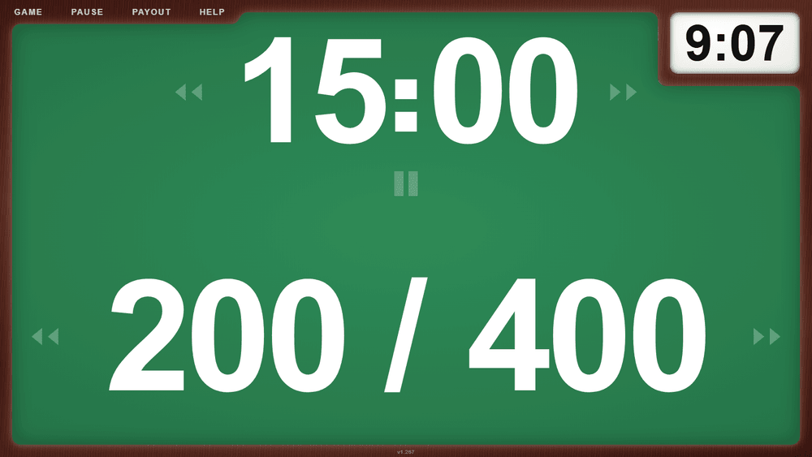

# Blinds UP! — Free Poker Blind Timer

A free, no-install poker blinds timer that runs in any browser. Works on phones, tablets, and laptops. No ads, no accounts, no app store.

**[▶ Launch the timer →](https://netwerxs.github.io/BlindsUP/)**



---

## Features

- **29 blind levels** — 1/2 through 180/360, automatically sequenced
- **Alarm** — a warm ascending arpeggio chime synthesized in-browser when blinds go up
- **Countdown ticks** — three wood-clack sounds at the 11-second mark of each level
- **Break screen** — level 5 pauses the countdown with a "Break" overlay for about a minute (tap to skip ahead); you then pick the next level from the menu
- **Adjustable timer** — add or subtract one minute on the fly
- **QR Sync** — the Lock button doubles as a QR code; scan it from a second device (via the menu's Sync card) to mirror the running timer there, landing on the exact correct time
- **One-tap updates** — the version label (bottom-right of the menu) checks for and installs updates
- **Wall clock** — always visible so you're not hunting for your phone
- **Touch, mouse, and keyboard** — swipe on phones/tablets; click ±zones or use arrow keys on desktop
- **Full screen + landscape lock** — press F11 on desktop; install to home screen on mobile for true full screen and automatic landscape orientation
- **Works offline** — installable PWA with service worker
- **No in-app volume control** — alarm level follows your device's hardware volume buttons
- **No build step, no backend** — one HTML file (two small libraries vendored inline for QR sync)

## Install as an app (recommended for iPad)

Blinds UP works best when installed to your home screen. You get:

- **Landscape lock** — screen stays horizontal automatically
- **Full screen** — no browser chrome in the way
- **Works offline** — no Wi-Fi needed at the table

**iPad / iPhone — Safari:**

1. Open **[https://netwerxs.github.io/BlindsUP/](https://netwerxs.github.io/BlindsUP/)** in Safari
2. Tap the **Share** button (box with arrow pointing up) in the toolbar
3. Scroll down and tap **Add to Home Screen**
4. Tap **Add** in the top-right corner
5. Open the app from your home screen — it launches full screen in landscape

> Safari is required on iOS/iPadOS. Chrome and Firefox on iPhone/iPad do not support PWA installation.

**Android — Chrome:**

1. Open the site in Chrome
2. Tap the three-dot menu → **Add to Home screen**
3. Tap **Add**

**Windows / Mac — Chrome or Edge:**

Click the install icon (⊕) in the address bar, or go to the browser menu → **Install Blinds UP**.

---

## Blind Schedule

| Levels | Blinds | Increment | Duration |
|--------|--------|-----------|----------|
| 1–5 | 1/2 → 5/10 | +1/+2 per level | 15 min each |
| — | Break | — | Timer stops; restart manually from the menu |
| 6–10 | 6/12 → 10/20 | +1/+2 per level | 10 min each |
| 11–13 | 15/30 → 25/50 | +5/+10 per level | 10 min each |
| 14–29 | 30/60 → 180/360 | +10/+20 per level | 10 min each |

## Controls

| Action | Touch | Mouse | Keyboard |
|--------|-------|-------|----------|
| Go up one blind level | Swipe right on blinds | Click right half of blinds | ↑ |
| Go down one blind level | Swipe left on blinds | Click left half of blinds | ↓ |
| Add 1 minute | Swipe left on timer | Click right half of timer | ← |
| Subtract 1 minute | Swipe right on timer | Click left half of timer | → |
| Pause / Resume | Tap Pause | Click Pause | — |
| Lock/unlock adjustments | Tap Lock | Click Lock | — |
| Full screen | Add to home screen | F11 | — |
| Return to menu | Hold Esc 3 seconds | Hold Esc 3 seconds | — |

## Running locally

No build step. Just open the file:

```
open index.html
```

Or serve it for PWA/service-worker support:

```
npx serve .
# or
python -m http.server
```

## How it works

Everything is in `index.html` — HTML, CSS, and vanilla JavaScript. No frameworks, no bundler, no server. Audio is synthesized with the Web Audio API. The timer uses wall-clock math (`Date.now()`) rather than accumulated intervals, so it stays accurate even when the tab is throttled.

## License

MIT
